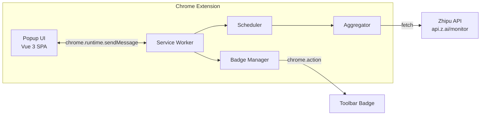

<p align="center">
  
</p>

<h1 align="center">GLM Coding Plan Monitor</h1>

<p align="center">
  <a href="README_CN.md">中文文档</a>
</p>

<p align="center">
  <strong>Chrome Extension</strong> for monitoring Zhipu GLM Coding Plan quotas, token usage, MCP tool calls, and model performance — right from your browser toolbar.
</p>

<p align="center">
  
  
  
  
  
</p>

---

## Features

| Feature | Description |
|---------|-------------|
| **Quota Dashboard** | Real-time token quota, MCP tool limits, with progress bars and color-coded thresholds |
| **Token Usage Charts** | Stacked bar charts for daily / 7-day / 30-day token consumption, broken down by model |
| **MCP Tool Analytics** | Visual breakdown of Search, Web Read, and ZRead tool usage across time ranges |
| **Model Performance** | Line charts tracking ProMax & Lite decode speed and success rate over 7/15/30 days |
| **Multi-Account** | Monitor multiple GLM accounts simultaneously, switch with one click |
| **Badge Indicator** | Toolbar badge shows remaining quota percentage with green/yellow/red color alerts |
| **Auto Refresh** | Configurable interval via `chrome.alarms` — data stays fresh without manual intervention |
| **Dark Mode** | Light / Dark / System-auto theme switching |
| **i18n** | Chinese & English interface, switch anytime |

## Screenshots

<p align="center">
  
</p>

## Installation

### Option 1: Download Pre-built Extension (Recommended)

| Mirror | Download |
|--------|----------|
| GitHub | [v1.1.0](https://github.com/Ethanzyc/glm-coding-plan-monitor/releases/tag/v1.1.0) |
| Gitee (China) | [v1.1.0](https://gitee.com/Ethanzyc/glm-coding-plan-monitor/releases/tag/v1.1.0) |

1. Download the latest `glm-coding-plan-monitor.zip` from the link above
2. Unzip the file to a folder of your choice
3. Open Chrome and navigate to `chrome://extensions/`
4. Enable **Developer mode** using the toggle in the top-right corner
5. Click **Load unpacked** (top-left) and select the unzipped folder
6. The extension icon will appear in your toolbar — pin it for easy access

### Option 2: Build from Source

```bash
git clone https://github.com/Ethanzyc/glm-coding-plan-monitor.git
# or: git clone https://gitee.com/Ethanzyc/glm-coding-plan-monitor.git
cd glm-coding-plan-monitor
npm install
npm run build
```

Then follow steps 3–6 above, selecting the `dist/` folder when loading unpacked.

### Setup API Key

1. Click the extension icon in the Chrome toolbar
2. Click the **Settings** gear icon (top-right of popup)
3. Paste your **GLM API Key** — you can get one from [open.z.ai](https://open.z.ai)
4. Click **Save** — data will start refreshing automatically

## Architecture



## Tech Stack

- **Vue 3** + **TypeScript** — Popup SPA with Composition API
- **Vite 6** — Build toolchain with plugin-based extension file copy
- **Chart.js** + **vue-chartjs** — Token, MCP, and performance visualizations
- **vue-i18n** — Multi-language support (zh-CN / en-US)
- **Chrome Extension Manifest V3** — Service worker background, `chrome.alarms` scheduling, `chrome.action` badge

## Development

```bash
# Dev mode (watch + rebuild on change)
npm run dev

# Production build
npm run build
```

## Acknowledgements

This project is a Chrome extension adaptation of [coding-quota-bar](https://github.com/hyizhou/coding-quota-bar) by [@hyizhou](https://github.com/hyizhou), an Electron + Vue 3 desktop app for multi-platform AI coding plan monitoring. The core data layer, chart components, and i18n are adapted from that project.

## Links

- **GitHub**: https://github.com/Ethanzyc/glm-coding-plan-monitor
- **Gitee**: https://gitee.com/Ethanzyc/glm-coding-plan-monitor

## License

[MIT](LICENSE)
