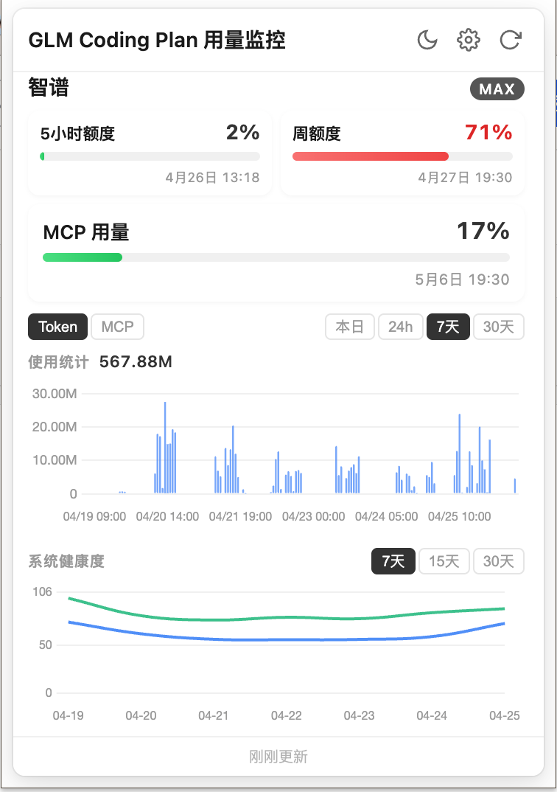
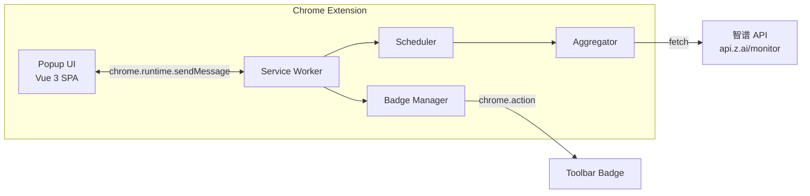

<p align="center">
  
</p>

<h1 align="center">GLM Coding Plan Monitor</h1>

<p align="center">
  <a href="README.md">English</a>
</p>

<p align="center">
  浏览器工具栏里的<strong>智谱 GLM Coding Plan</strong>配额监控面板 —— Token 用量、MCP 工具调用、模型性能，一目了然。
</p>

<p align="center">
  
  
  
  
  
</p>

---

## 功能一览

| 功能 | 说明 |
|------|------|
| **配额面板** | 实时展示 Token 配额、MCP 工具额度，进度条 + 阈值变色 |
| **Token 用量图表** | 按模型拆分的堆叠柱状图，支持 1 天 / 7 天 / 30 天切换 |
| **MCP 工具分析** | Search、Web Read、ZRead 三类工具使用量可视化 |
| **模型性能追踪** | ProMax & Lite 解码速度与成功率折线图，7/15/30 天趋势 |
| **多账号管理** | 同时监控多个 GLM 账号，一键切换 |
| **角标提醒** | 工具栏图标实时显示剩余配额百分比，绿/黄/红三级预警 |
| **自动刷新** | 通过 `chrome.alarms` 定时拉取，数据始终保持最新 |
| **深色模式** | 浅色 / 深色 / 跟随系统，三种主题自由切换 |
| **中英双语** | 中文 / 英文界面，随时切换 |

## 截图预览

<p align="center">
  
</p>

## 安装

### 方式一：从 GitHub Releases 下载（推荐）

1. 前往 [Releases 页面](https://github.com/zhuyuchen/glm-coding-plan-monitor/releases) 下载最新的 `glm-coding-plan-monitor.zip`
2. 解压到你喜欢的目录
3. 打开 Chrome，地址栏输入 `chrome://extensions/`
4. 打开右上角的 **开发者模式** 开关
5. 点击左上角 **加载已解压的扩展程序**，选择解压后的文件夹
6. 扩展图标将出现在工具栏 —— 点击图钉固定到工具栏

### 方式二：从源码构建

```bash
git clone https://github.com/zhuyuchen/glm-coding-plan-monitor.git
cd glm-coding-plan-monitor
npm install
npm run build
```

然后按上面步骤 3–6 操作，加载时选择 `dist/` 目录。

### 配置 API Key

1. 点击 Chrome 工具栏中的扩展图标
2. 点击右上角的 **设置** 齿轮图标
3. 粘贴你的 **GLM API Key** —— 可从 [open.z.ai](https://open.z.ai) 获取
4. 点击 **保存** —— 数据将自动刷新

## 架构



## 技术栈

- **Vue 3** + **TypeScript** — 基于 Composition API 的弹窗 SPA
- **Vite 6** — 构建工具链，插件化复制扩展文件
- **Chart.js** + **vue-chartjs** — Token、MCP、性能数据可视化
- **vue-i18n** — 多语言支持（中文 / English）
- **Chrome Extension Manifest V3** — Service Worker 后台、`chrome.alarms` 定时调度、`chrome.action` 角标

## 开发

```bash
# 开发模式（文件变更自动重新构建）
npm run dev

# 生产构建
npm run build
```

## 致谢

本项目基于 [coding-quota-bar](https://github.com/hyizhou/coding-quota-bar)（by [@hyizhou](https://github.com/hyizhou)）进行 Chrome 扩展适配。原项目是一个 Electron + Vue 3 桌面应用，用于多平台 AI Coding Plan 监控。本项目的核心数据层、图表组件和国际化方案均改编自该项目。

## 许可证

[MIT](LICENSE)
